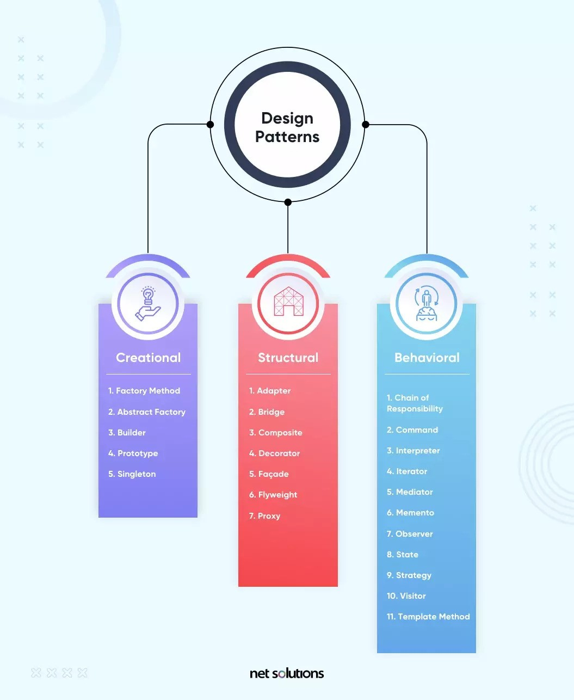

## What are Design Patterns?
Design patterns refer to reusable solutions to common problems that occur during the design and development of software systems. These patterns include best practices, proven strategies, and general guidelines for designing flexible, scalable, and maintainable code. 

Design patterns provide a structured approach to solving specific design challenges, offering developers well-defined templates/blueprints to follow. They promote code reusability, modularization, and abstraction, leading to better software design in general.

## Have I used Design Patterns?
YES! I'm using them right now! 

Currently, I'm working with a team to develop an application displaying food vendors on the UH Manoa campus. We are using a MongoDB collection to store all our vendors and their information.

Example:
```
class VendorsCollection {
  constructor() {
    this.name = 'VendorsCollection';

    this.collection = new Mongo.Collection(this.name);

    this.schema = new SimpleSchema({
      name: String,
      image: String,
      location: {
        type: String,
        allowedValues: ['Campus Center', 'Paradise Palms', 'Food Truck Row', 'Hemenway Hall', 'Residential Dining'],
      },
      hours: String,
      owner: String,
      menuImage: String,
    });

    this.collection.attachSchema(this.schema);
    this.userPublicationName = `${this.name}.publication.user`;
    this.vendorPublicationName = `${this.name}.publication.vendor`;
    this.adminPublicationName = `${this.name}.publication.admin`;
  }
}
```
