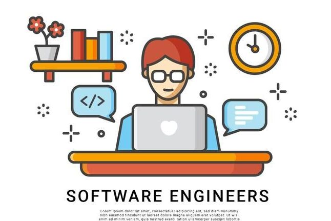

## Intro
I have learned a lot throughout this course in software engineering. During my journey, the two areas that stood out to me are the Coding Standards and the Issue Driven Project Management style we learned. These two areas stood out to me mainly because of their importance on group projects and collaborations with other people.

## Coding Standards
I love uniformity in my code. When I'm working on a project with other people, I'm going to want them to write code the same way that I'm doing. Obviously this might not be fair to the other people because what if they're coding style is much different from mine? I can't expect them to sacrifice that while I sacrifice nothing. So why not meet in the middle? Why not use a coding style that everyone agrees on. Coding standards makes sure that everyone adheres to it. It makes sure our code looks the same. It makes is easier for me to read and understand other peoples code and it makes it easier for them to read and understand my code. Brilliant! It keeps our code in order and protects it from falling to chaos. 

## Issue Driven Project Management
We learned about a style of Agile Project Management called Issue Driven Project Management. We had fixed-length iterations/releases via our different Milestones where our group laid out the issues we wanted to get done for the first milestone and then released our product at the time regardless of what we finished and did not finish. We then started on the second milestone where we repeated the process. This also helped us break down our project into smaller much more managable issues that each group member could then assign themselves to and work on. This makes it very clear to the other members when something is being worked on, who's working on it, and when it's finished. This is extremely important because we don't want group members doing nothing while they wait on others to finish a task, increasing overall efficiency. Our branch names were also based off of the issue number we were working on making things very easy to keep track of and manage even when issues end up getting changed.
