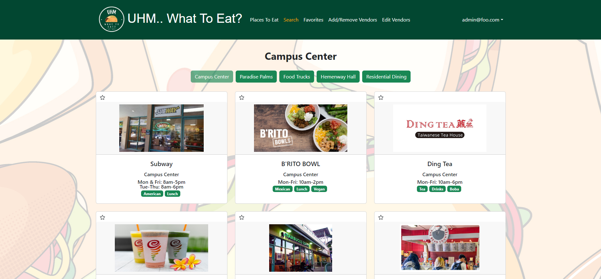

## INTRODUCING: UHM... What To Eat?
UHM... What To Eat is a web application project that I worked on with fellow software engineer students. It serves to answer the age old question, 'uhm.. what to eat?'.

The application has a lot to offer for users. When users want to find a place/places to eat there's a few places they can start. As soon as users sign in, they're greeted with a few potential places to eatThe 'Places To Eat' page offers a list of locations on the UH Manoa campus that then displays each food vendor for that given location when selected. Users can also use the 'Search' page to search for vendors that match certain categories such as Asian food or drinks, or breakfast food.

Users are also able to favorite certain vendors that they like and view them on a seperate 'Favorites' page for added customizability. 

Each vendor additionally has a menu page that displays not just their menu, but also a few popular/recommended items to help users find: 'What To Eat'!

There's also plenty of administrative features for vendors and administrators to create edit and remove things for a vendor. 

## My Contributions
-Created the Vendors collection
-Created the Places To Eat page and the cards that are displayed for each vendor. 
-Created the Favorite feature that allows users to favorite/unfavorite vendors and the page they are displayed on. 
-Created the Menu Page for each vendor as well as the recommended items collection that is displayed on the menu page.
-Implemented the edit/add/remove functionality for vendors and admins to edit the information on their card as well as their menu image and recommended menu items.

## What Did I Learn
Working on a web application in a group was such a wonderful experience. This was the first time I've had to collaborate in a coding/web application project and I learned a tremendous amount about project management and working on a team. I got to experience how to manage conflicting opinions for the direction of the project. I got to experience synchronous coding on the same file as others through branch managing and merging to vastly improve the groups overall efficiency. This project was honestly so much more enjoyable than I was expecting and a wonderful learning experience.

## GitHub Page
For those who want to see the source code and learn more about our project:
[Link to Repository](https://github.com/uhm-what-to-eat/source-code).
